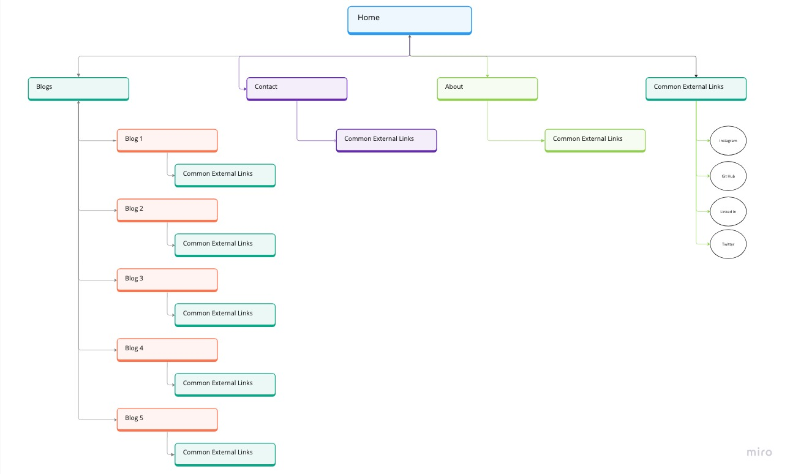
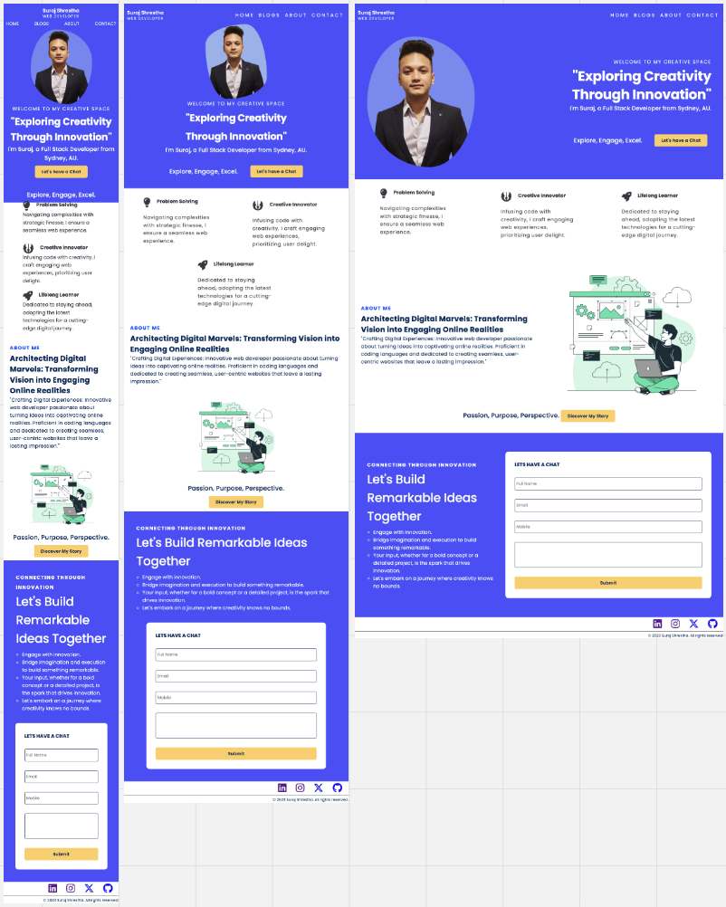
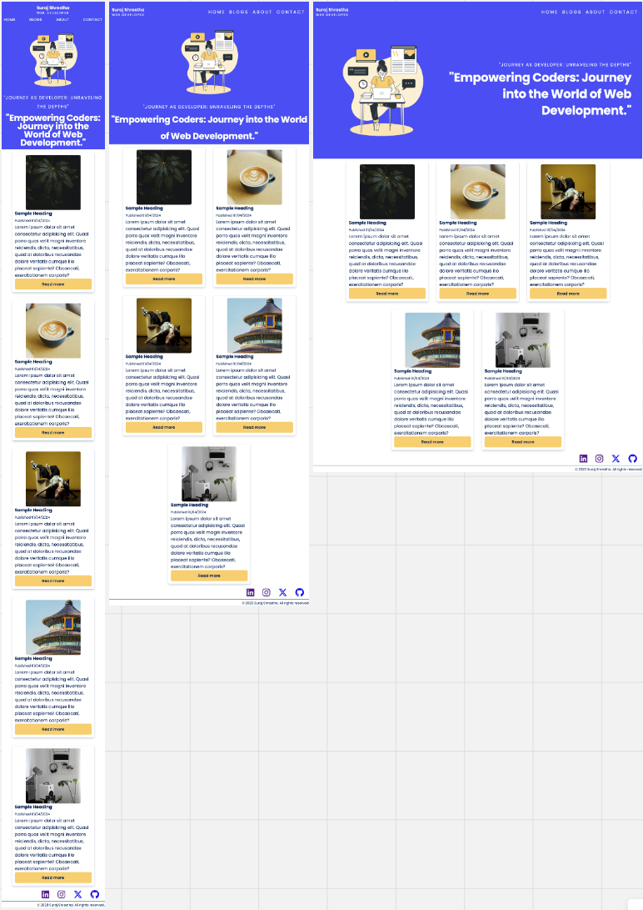
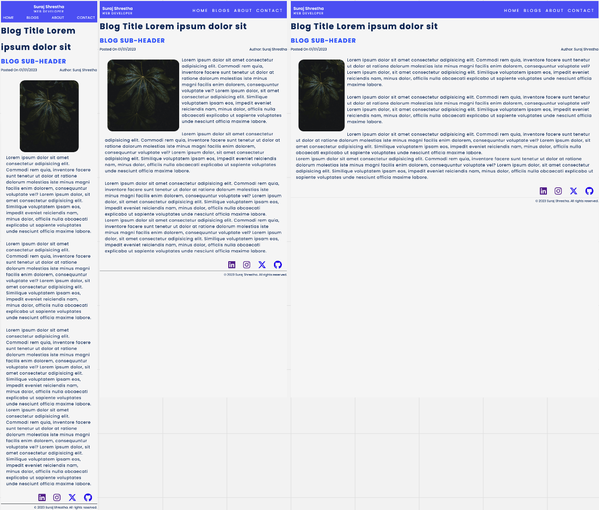
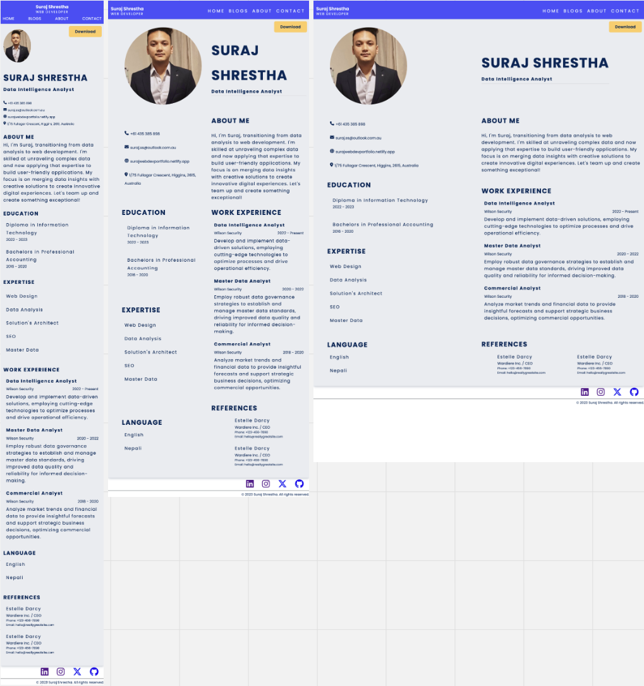
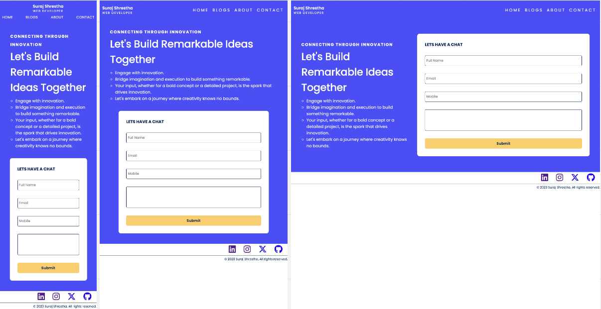

# Web Dev Portfolio

## Published Portfolio

### [Suraj's Portofolio](https://surajwebdevportfolio.netlify.app)

URL - https://surajwebdevportfolio.netlify.app

## Github Repo

URL - https://github.com/Suraj-Razor/Portfolio

## Presentation

URL - https://www.youtube.com/watch?v=3zL8EQxnkVo

## Purpose

The purpose of this portfolio is to showcase prospective employers and followers my skills, interets, passion and drive.

## Functionality / features

1. Menu item highlighting: When a visitor navigates to a particular section of the site, a function could be called to highlight the corresponding menu item, providing a subtle visual cue for navigation.

2. Contact form submission: When a visitor submits the contact form, a function could be triggered to send the form data to the site owner's email address, facilitating communication and follow-up.

3. Responsive Web Design: The portfolio is responsive and adapts well to different screen sizes and devices. This ensures that the viewer has an optimal viewing experience regardless of their device.

4. Overall Asthetic: The overall asthetic of this portfolio is modern, sleek, and professional. The color palette, typography, imagery, spacing, and layout all contribute to this consistent and visually appealing design through out the page.

5. Color Palette: The color palette used in this portfolio website is carefully chosen and visually appealing. It combines the warmth of the white background with the depth of the blue colors to create a balanced and visually engaging design.

6. Flex: The website effectively uses flex to create a responsive and visually appealing layout. It also employs media queries to adapt the layout based on screen size, further enhancing the user experience.

## Site Map

Site map of portfolio website

## Website Screenshots

### Home

### Blog

### Read Blog

### About

### Contact

## Target Audience

- Potential Employers/Clients
- Industry Peers
- Networking Connections
- Students/Aspiring Professionals
- Recruiters/Headhunters

## Tech Stack

- HTML
- CSS
- SCSS
- Github
- Netlify
- Miro
- Trello
- Visual Studio
